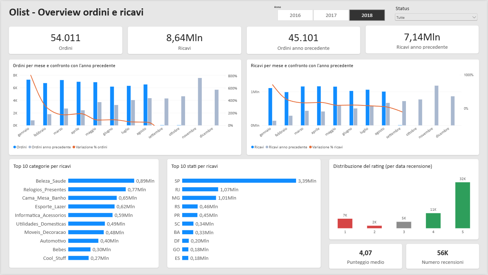
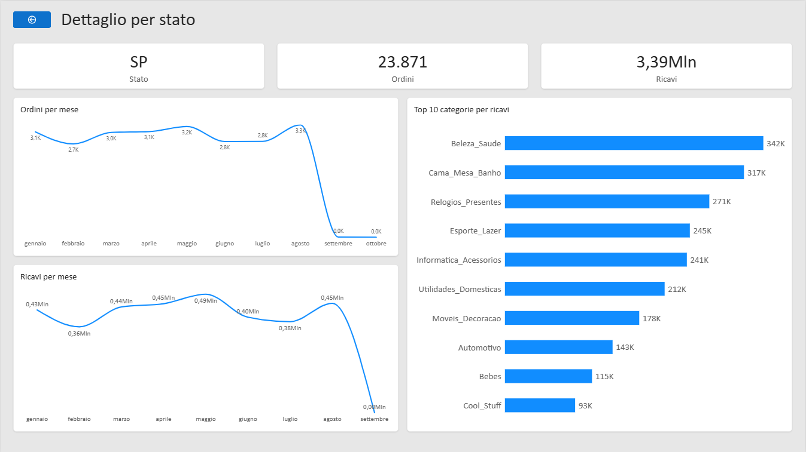
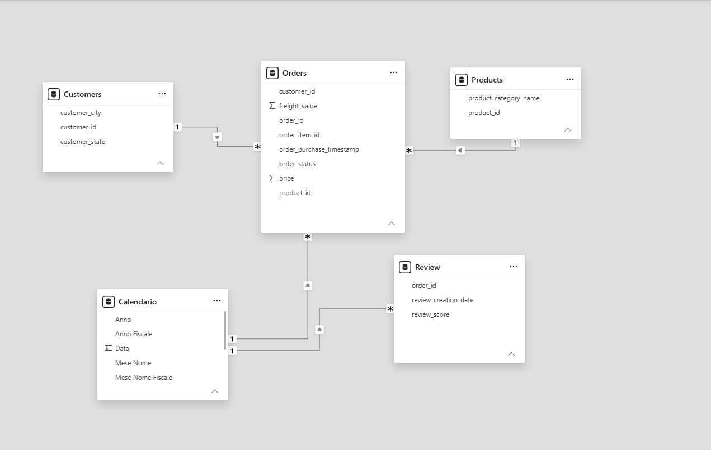

# Olist E-commerce: report Power BI

Esercitazione finale del modulo Power BI (Epicode Data Analytics & AI).
Report di BI sul dataset pubblico Olist (e-commerce brasiliano, ordini dal 2016 al 2018) per analizzare l'andamento di ordini e ricavi, con confronto rispetto all'anno precedente, e la distribuzione del rating.

**Autore:** Francesco Fancello

## Obiettivi di analisi

- Andamento degli **ordini** mese per mese, con anno selezionabile, confronto con l'anno precedente e variazione percentuale, filtrabile per status dell'ordine.
- Andamento dei **ricavi** (prezzo + spedizione) con la stessa logica.
- **Distribuzione del rating** (`review_score`).
- Analisi extra: ricavi per categoria di prodotto e per stato, con **drill-through** su una pagina di dettaglio per stato.

## Contenuto del repository

| File | Descrizione |
|---|---|
| `olist_report.pbix` | Report Power BI (aprire con Power BI Desktop) |
| `olist_report.pdf` | Esportazione PDF delle pagine, anno 2018 e nessun filtro sullo status |
| `img/` | Screenshot del modello dati e delle due pagine |

I CSV originali non sono inclusi (uno solo, `geolocation`, supera i 60 MB): il dataset è il pubblico Olist Brazilian E-Commerce.

## Anteprima





## Modello dati

Sono state caricate solo le 5 tabelle necessarie (`orders`, `order_items`, `products`, `order_reviews`, `customers`), riducendo le colonne a quelle usate nelle analisi.



- **Orders** (tabella dei fatti): unione di `orders` e `order_items` con un Left Outer Join su `order_id`. Una riga per articolo dell'ordine (113.425 righe, che includono 775 ordini senza articoli).
- **Customers** e **Products**: dimensioni collegate a `Orders` (uno-a-molti, filtro singolo). Le categorie mancanti sono state sostituite con "Non classificato".
- **Calendario**: tabella data (2016-2018) creata in DAX, collegata a `Orders[order_purchase_timestamp]`.
- **Review**: collegata a `Calendario` tramite `review_creation_date`.
- **Misure**: tabella dedicata alle misure DAX.

## Misure DAX

```dax
Ordini = DISTINCTCOUNT ( Orders[order_id] )

Ricavi = SUMX ( Orders, Orders[price] + Orders[freight_value] )

Ordini anno precedente =
CALCULATE ( [Ordini], SAMEPERIODLASTYEAR ( Calendario[Data] ) )

Ricavi anno precedente =
CALCULATE ( [Ricavi], SAMEPERIODLASTYEAR ( Calendario[Data] ) )

Variazione % ordini =
VAR Soglia = 100
VAR OrdiniCorr = [Ordini]
VAR OrdiniPrec = [Ordini anno precedente]
VAR OrdiniPrecTutti =
    CALCULATE ( [Ordini anno precedente], REMOVEFILTERS ( Orders[order_status] ) )
RETURN
    IF (
        OrdiniCorr = 0 || OrdiniPrecTutti < Soglia,
        BLANK (),
        DIVIDE ( OrdiniCorr - OrdiniPrec, OrdiniPrec )
    )

Variazione % ricavi =
VAR Soglia = 100
VAR RicaviCorr = [Ricavi]
VAR RicaviPrec = [Ricavi anno precedente]
VAR OrdiniPrecTutti =
    CALCULATE ( [Ordini anno precedente], REMOVEFILTERS ( Orders[order_status] ) )
RETURN
    IF (
        RicaviCorr = 0 || OrdiniPrecTutti < Soglia,
        BLANK (),
        DIVIDE ( RicaviCorr - RicaviPrec, RicaviPrec )
    )

Numero recensioni = COUNTROWS ( Review )

Punteggio medio = AVERAGE ( Review[review_score] )
```

## Pagine del report

1. **Overview**: card (ordini, ricavi, anno precedente), andamento mensile di ordini e ricavi con anno precedente e variazione %, top 10 categorie, top 10 stati, distribuzione del rating. Slicer su anno e status.
2. **Dettaglio stato**: pagina di drill-through raggiungibile con il clic destro su uno stato (ordini, ricavi, andamento mensile e categorie dello stato selezionato).

## Scelte e limiti

- **Conteggio degli ordini.** La traccia indica `order_item_id`, che conta le righe di articolo (112.650 sul totale). La misura `Ordini` conta invece gli `order_id` distinti (99.441), così il filtro sullo status include anche gli ordini senza articoli (ad esempio `unavailable`, quasi tutti privi di articoli).
- **Decimali.** I CSV usano il punto come separatore decimale: `price` e `freight_value` sono importati con impostazioni locali inglesi (en-US). Con le impostazioni italiane i valori risultano moltiplicati per 100.
- **Rating.** `order_id` non è univoco in `Review` (547 ordini con più recensioni), quindi non è possibile una relazione uno-a-molti con `Orders`. `Review` è collegata al calendario tramite la data di creazione della recensione: il rating risponde allo slicer dell'anno ma non a quello dello status.
- **Variazione %.** Viene mostrata solo se l'anno precedente ha almeno 100 ordini (soglia scelta arbitrariamente), altrimenti le percentuali su basi minime (ad esempio dicembre 2016, un solo ordine) non hanno significato.
- **Copertura dei dati.** Nel 2016 ci sono pochissimi ordini e da settembre 2018 quasi nessuno: il confronto anno su anno è significativo per il 2018 rispetto al 2017, nei mesi da gennaio ad agosto. Le card con l'anno precedente confrontano un anno intero.
- **Valuta.** Gli importi originali del dataset sono in reais brasiliani (BRL). Nel report il formato valuta mostra il simbolo del dollaro ($) per comodità: non è stata applicata nessuna conversione, quindi i valori restano in BRL.

## Come aprire il progetto

1. Aprire `olist_report.pbix` con Power BI Desktop.
2. Per aggiornare i dati servono i 9 CSV originali: in **Trasforma dati**, nella query `archive`, passaggio **Origine**, impostare il percorso della cartella che li contiene.
